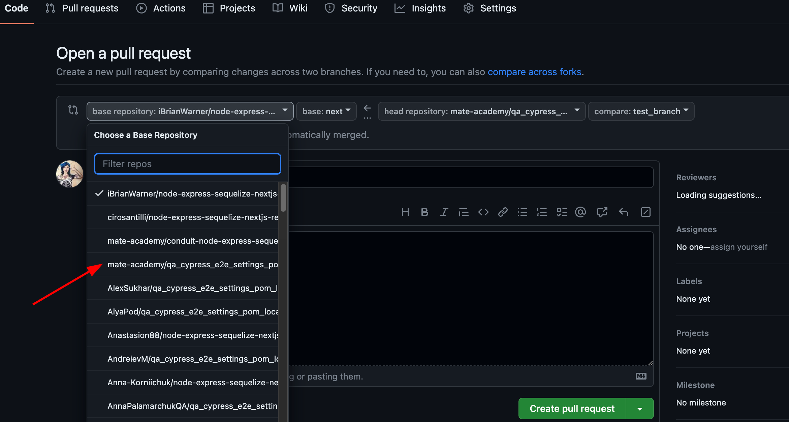

# Cypress: Settings

## Workflow

1. Fork the repo.
1. Clone **your** forked repository.
1. Clone [this](https://github.com/iBrianWarner/realworld) repo into you repo.
1. Create a new branch `git checkout -b e2e_testing`.
1. Run the [app](./DEV.adoc) (Local development with SQLite).
1. Resolve tasks.
1. Record a video of your running your tests (you can use Loom).
1. Check yourself before submitting the task with a [Cypress checklist](https://mate-academy.github.io/qa-program/checklists/cypress.html).
1. Create a pull request.
   - note, you have to make a PR to this branch:
    
1. Attach a link to your video to the PR description.
1. Do not forget to click on `Re-request review` if you submit the homework after previous review.

## Task

Go to `e2e` folder and cover listed functionality with e2e tests:

- updating bio;
- updating username;
- updating email;
- updating password

### Requirements

1. Clear all data from the database before the test.
1. Add `data-cy` attributes for all elements you are working with in tests.
1. Use faker and custom methods to generate a fake data in tests.
1. Use PageObject pattern for your tests:
   - create a files with POM classes for your pages in `cypress`/`support`/`pages`.
   - use `PageObject.js` file for the common for the whole app elements.

Observe an example in `cypress`/`e2e`/`signIn.cy.js`.  
Find and additinoanl about Page Object in the [Cypress](https://mate.academy/learn/javascript-testing/cypress#/theory) topic.
